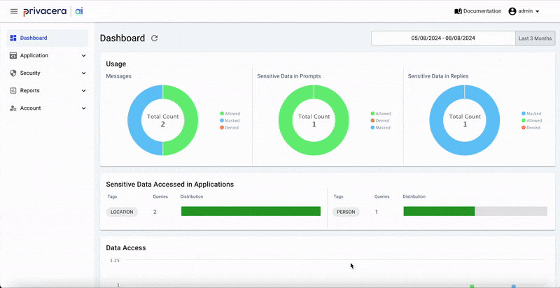

# PAIG Opensource
PAIG offers tools designed to enhance the security and compliance of your AI applications. Whether you're using chatbots internally, incorporating AI services into your products, or utilizing automated tools to process tasks like customer support tickets or feedback, PAIG ensures that you maintain the highest standards of security and adherence to compliance. It's tailored for businesses that value a robust yet straightforward approach to AI application governance. 

# What is PAIG?
PAIG is a web application that provides a platform for AI governance and audits that data.

## Contents
- [Overview](#overview)
- [Quick Start](backend/README.md)
- [Start Development Server](backend/paig/README.md)
- [Contributing to PAIG](#contributing)

## Overview 
PAIG provides a platform for AI governance. It allows users to governance and audits the data on one platform. PAIG uses multiple services to provide the governance and audits.

## Contributing to PAIG 
All contributions, bug reports, bug fixes, documentation improvements, enhancements, and ideas are welcome.
A detailed overview on how to contribute can be found in the [contributing guide](docs/CONTRIBUTING.md).
 As contributors and maintainers to this project, you are expected to abide by `PAIG` code of conduct. More information can be found at [code of conduct](docs/CODE_OF_CONDUCT.md).
