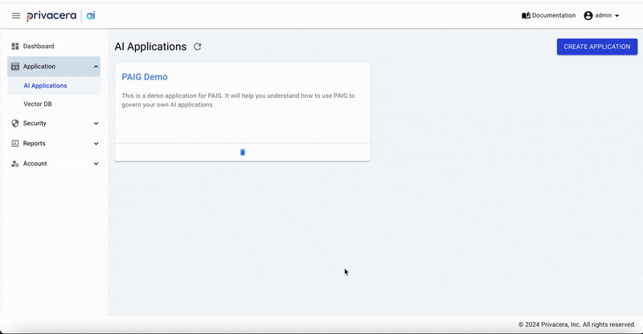

# Govern Your LLM Interaction Using the Plugin
PAIG provides a platform to secure and govern your AI applications. You can use the PAIG to secure and govern your LLM interactions.

## Prerequisites
- PAIG web application should be up. You can refer to [Quick Start](QUICK_START_README.md)
- Dependency should be installed . You can install them by
   ```shell
   pip install paig_client openai
   ```


## 1. Create a New Application

1. **Access PAIG Portal**:
   - Navigate to `Application > AI Application` in the PAIG portal.
2. **Create Application**:
   - Click the **CREATE APPLICATION** button in the top-right corner.
   - Enter the required details and click **CREATE**.

## 2. Download the AI Application Configuration

1. **Navigate to AI Applications**:
   - Go to `Application > AI Applications` in the PAIG portal.
2. **Download Configuration**:
   - Select the desired application.
   - Click the **DOWNLOAD APP CONFIG** button in the top-right corner.
3. **Save Configuration**:
   - Create a `privacera` directory and save the downloaded configuration file there:
     ```shell
     mkdir -p privacera
     ```

   

## 3. Set Up Your OpenAI API Key

1. **Configure Environment Variable**:
   - Set the OpenAI API key as an environment variable:
     ```shell
     export OPENAI_API_KEY=<YOUR_API_KEY>
     ```
## 4. Initialize Privacera Shield and Run the LLMChain
<br>This one line of code will initialize the Privacera Shield library so that it is ready to protect your LangChain application.

   1. In this step, we are going to run the LLMChain with the prompt asked by a user named `testuser`.
   2. Note how we are passing the username by creating a Privacera Shield context object.
   3. Privacera Shield will intercept the prompt and the response coming from LLM for the `testuser` and run policies.
   4. The PAIG service scans both the prompt and response text and runs security policies.
   5. If the policies decide that the access is denied then an AccessControlException is thrown.

   > **Tip:** If you get an error in this step, check the correct AI Application configuration save under privacera directory and valid OpenAI API key, Run again below code.

   > **Note:** Here username used is `testuser` which is an external user. So the policies applied will be as per the public. For applying userspecific properties, create and use the user from PAIG portal `Account > User Management > User`.

   
   ```Python
   from paig_client import client as paig_shield_client
   from openai import OpenAI
   from paig_client.model import ConversationType
   import paig_client.exception
   import uuid
   
   # Set the OPENAI_API_KEY environment variable or set it here
   openai_client = OpenAI()
   
   paig_shield_client.setup(frameworks=[])

   # Replace "testuser" with the user who is using the application. Or you can use the service username
   user = "testuser"
   
   # Generate a random UUID which will be used to bind a prompt with a reply
   privacera_thread_id = str(uuid.uuid4())
   
   try:
      with paig_shield_client.create_shield_context(username=user):
         prompt_text = "Who was the first President of USA and where did they live?"
         print(f"User Prompt: {prompt_text}")
         # Validate prompt with Privacera Shield
         updated_prompt_text = paig_shield_client.check_access(
            text=prompt_text,
            conversation_type=ConversationType.PROMPT,
            thread_id=privacera_thread_id
         )
         updated_prompt_text = updated_prompt_text[0].response_text
         print(f"User Prompt (After Privacera Shield): {updated_prompt_text}")
         if prompt_text != updated_prompt_text:
            print(f"Updated prompt text: {updated_prompt_text}")
   
         # Call LLM with updated prompt text
         PROMPT = f"""Use the following pieces of context to answer the question at the end.
            {updated_prompt_text}
            ANSWER:
            """
   
         response = openai_client.chat.completions.create(model="gpt-4", messages=[{"role": "user", "content": PROMPT}],
                                                            temperature=0)
         llm_response = response.choices[0].message.content
         print(f"LLM Response: {llm_response}")
         # Validate LLM response with Privacera Shield
         updated_reply_text = paig_shield_client.check_access(
            text=llm_response,
            conversation_type=ConversationType.REPLY,
            thread_id=privacera_thread_id
         )
         updated_reply_text = updated_reply_text[0].response_text
         print(f"LLM Response (After Privacera Shield): {updated_reply_text}")
   except paig_client.exception.AccessControlException as e:
      # If access is denied, then this exception will be thrown. You can handle it accordingly.
      print(f"AccessControlException: {e}")
```

## 5. Review the access audits in PAIG portal under Security menu option
   1. Now you can log in to the PAIG portal and check under `Security > Access Audits` section. You will see the audit record for the above run of your LangChain application.
   2. You can click on the `More Details` and see the details of the prompts sent by the application to the LLM and the responses coming from the LLM.
   3. The default policy in PAIG for the application monitors the flow and tags the contents of the prompt and response.

