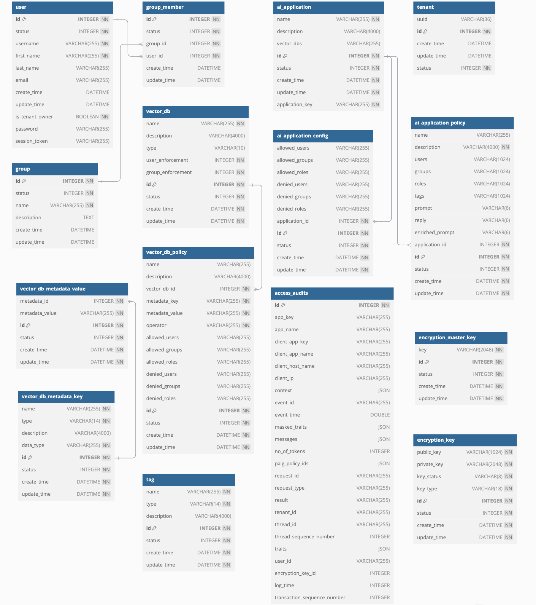

# Database Overview

This document provides a brief overview of the PAIG database and its relationships. PAIG support multiple databases like MySQL, PostgreSQL, and SQLite through SQLAlchemy ORM.

## Overview Diagram
The following diagram shows the high-level architecture of the PAIG database:

