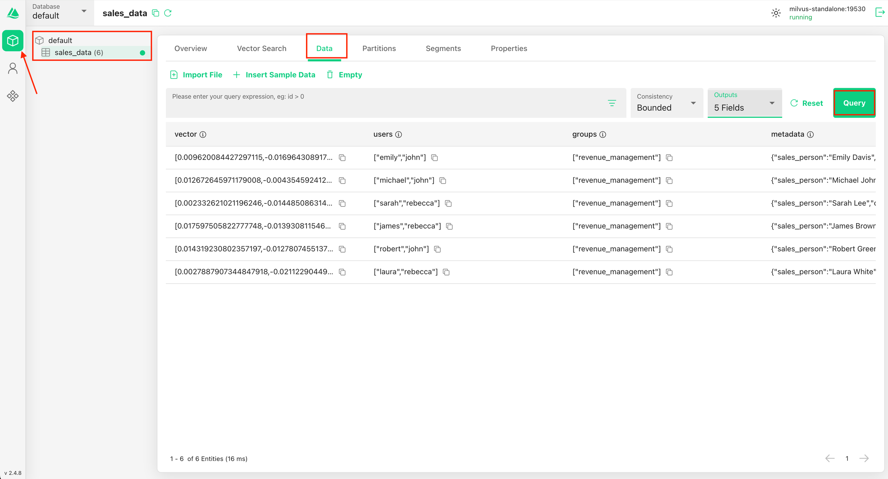
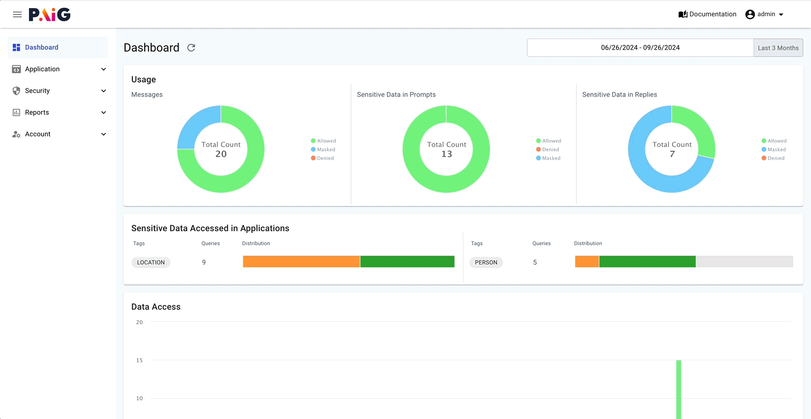
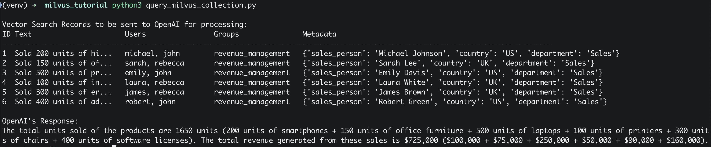
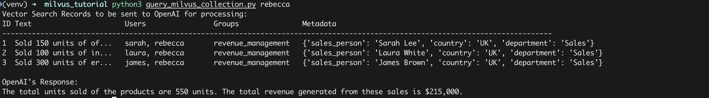
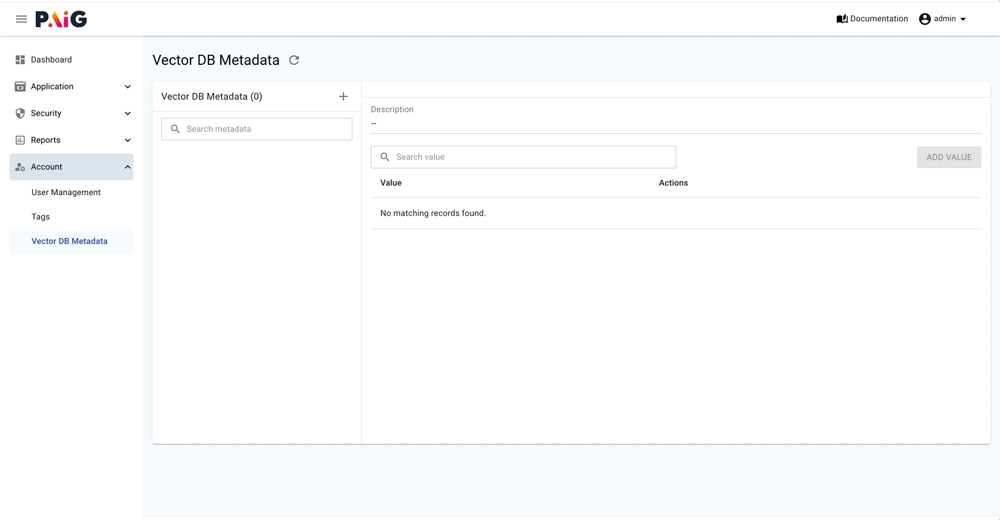
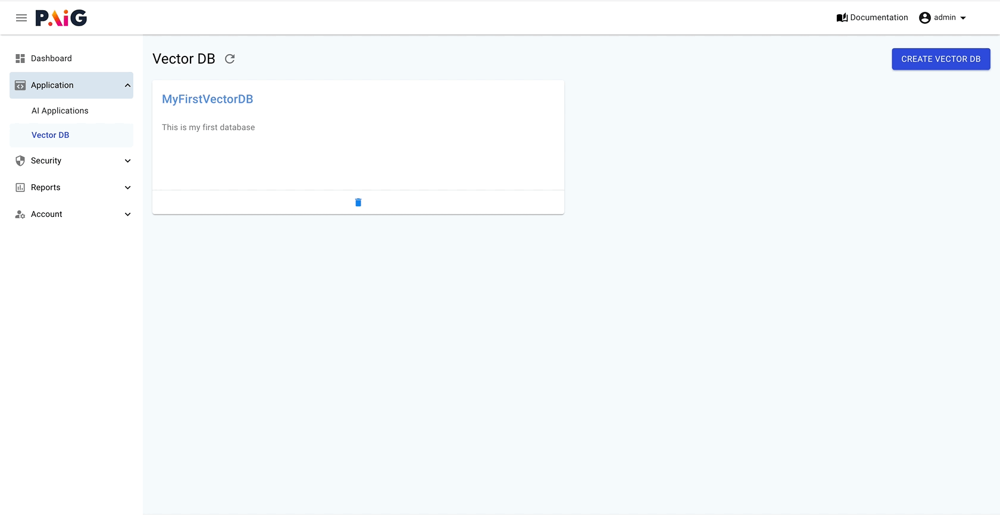
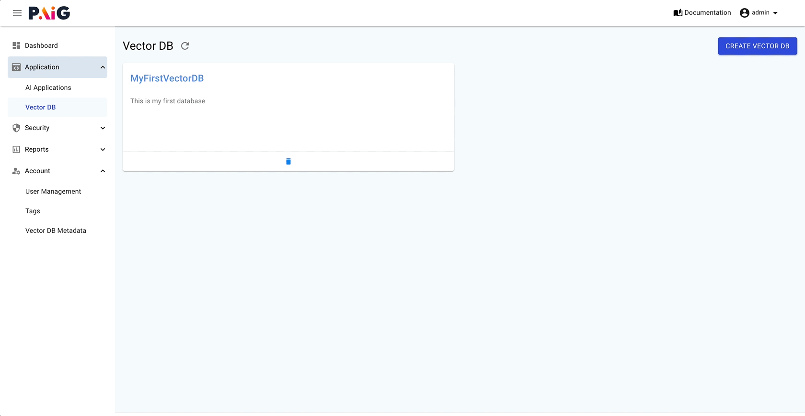
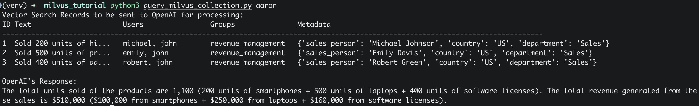

# Milvus Integration Sample Tutorial

This tutorial shows you how to prevent unauthorized access to your data by:

- Restricting access based on users and groups.
- Restricting access based on metadata policies.

## Prerequisite tasks

### Install PAIG Server
Make sure you have PAIG Server up and running. If you don't have one, you can follow the [PAIG Server Installation Guide](../../../paig-server/installation.md){target="_blank"} to set up your own PAIG Server.

### Install Docker 
!!! note "Note"
    If you have your own Milvus server running and you want to use that, you can skip this step.
Make sure you have Docker installed on your system. You can download it from the [Docker website](https://www.docker.com/products/docker-desktop/){target="_blank"}.

#### Start Milvus and Attu server
Download below docker-compose file and place them in new directory where you want to run the tutorial.

 - <a href="files/docker-compose.yml" download="docker-compose.yml">docker-compose.yml</a>

Run the following command in the directory where you placed the files.
    ```bash
    docker-compose up -d
    ```

### Set up the tutorial directory
Download below files and place them in new directory where you want to run the tutorial.

 - <a href="files/requirements.txt" download="requirements.txt">requirements.txt</a>
 - <a href="files/create_milvus_collection.py" download="create_milvus_collection.py">create_milvus_collection.py</a>
 - <a href="files/query_milvus_collection.py" download="query_milvus_collection.py">query_milvus_collection.py</a>


### Install the required Python packages
Run the following command to install the required Python packages. 

For this tutorial, we will be installing the `milvus`, `openai` and `paig_client` packages.

- Create a virtual environment and activate it.
  ```bash
  python3 -m venv venv
  source venv/bin/activate
  ```
- Install the required packages.
  ```bash
  pip install -r requirements.txt
  ```

### Export your OpenAPI key
Export your OpenAI API key as an environment variable to use ir further in the code to create the embeddings.
   ```bash
   export OPENAI_API_KEY=<your_openapi_key>
   ```

### Export milvus host and port
Export your Milvus host and port as an environment variable to use it further in the code. Please update host and port as per your setup if you are using your own Milvus server.
   ```bash
   export MILVUS_HOST=localhost
   export MILVUS_PORT=19530
   ```

### Create Milvus collection
Run the following command to create a Milvus collection with sample data.
   ```bash
   python3 create_milvus_collection.py
   ```
   
### Verify the created collection
To view the collection and the data inside it, open your web browser and navigate to [http://localhost:3000](http://localhost:3000){target="_blank"}. You should see the Attu interface, where you can browse collections, visualize data, and run queries.
This is how the data will look like below in Attu interface.

{ loading=lazy }

### Understanding the data
The data in the collection contains the following fields:

- Text: A brief description of the transaction, truncated for brevity.
- Users: The names of users (sales and department managers) who have access to this record.
- Groups: The group who has access to this record.
- Metadata: Additional information stored in JSON format, including the sales person's name, the country of sale, and the department.
- Vector: The embeddings for the text field, represented as a list of floating-point numbers truncated for brevity.

### Create the users
In this tutorial, we will be using **rebecca** and **aaron** as users. Please create these users in the PAIG portal following the steps below.

<a href="images/create_user.gif">{ loading=lazy }</a>

- Log in to the PAIG portal and Navigate to **Account > User Management** and click on the **ADD USER** button in the top right corner. 
- Fill in the required details, keep the usernames in lowercase, select the role as **USER**.
- Click on **SAVE**.

### Create Vector DB

<a href="images/create_milvus_vector_db.gif">{ loading=lazy }</a>

Log in to the PAIG portal and navigate to **Application > VectorDB**. Click the **CREATE VECTOR DB** button in the top right corner. Select **Milvus** as the type and complete the required details to create a new VectorDB.

### Create AI Application

<a href="images/create_milvus_ai_app.gif">{ loading=lazy }</a>

Navigate to **Application > AI Application** and click the **CREATE APPLICATION** button in the top right corner. Fill in the required details and, under **Associated VectorDB**, 
select the VectorDB created in the previous step to link the application with the VectorDB.

### Download Application Configuration File
Navigate to the application you created in the previous step and click the **DOWNLOAD APP CONFIG** button in the top right corner. 
Save the downloaded configuration file in a folder named `privacera` within the root directory of your code.

### Query the Milvus collection
Run the following command to query the Milvus collection.
   ```bash
   python3 query_milvus_collection.py
   ```

#### Understanding the results
In the above script, we have asked the OpenAI to tell us “**What are the total units sold of our products and how much revenue was generated?**“

Below is the output which shows, all total of 6 records are sent to OpenAI for processing and units sold and revenue was calculated from it.

<a href="images/output-no-filter.png">{ loading=lazy }</a>


## Setup PAIG Client

!!! info "**Setup PAIG Client**" 
    The code changes discussed below are already implemented in the `query_milvus_collection.py` script.
    This section is for reference purposes only.

### Initialize PAIG Client
To enable access control for Milvus in your application, include the following code snippet during the application's startup phase. This ensures that data filter policies are consistently enforced throughout the application's lifecycle. 
This snippet needs to be executed once hence recommended to put at application startup.

We will place this snippet right before the call to perform the search and query:

```python
# Perform the search and query
query_results = search_and_query(....)
```

So now it will look like below

```python
from paig_client import client as paig_shield_client

paig_shield_client.setup(frameworks=["milvus"])

# Perform the search and query
query_results = search_and_query(....)
```

### Contextualizing User Queries with PAIG
To let PAIG know about the user who is asking, we will wrap the vector search operation `search_and_query(...)` method call—within the `paig_shield_client` context. 
This ensures that the data retrieval is aware of the user's identity and applies the appropriate filters based on their access permissions. 
The updated code snippet should look like this:

```python
with paig_shield_client.create_shield_context(username="<user_asking_question>"):
    ...

    # Perform the search and query
    query_results = search_and_query(user_question)

    ...
```


## Restricting access based on users and groups 
In this example we will be setting our user as `rebecca` and we will ensure that rebecca only retrieves records she has access to. 
According to our dataset, Rebecca is listed in the users column of three records. 
This means she should only have access to those specific records and receive revenue numbers based on them.

#### Setup User/Group Access-Limited Retrieval
This setting ensures that every user receives filtered records based on their access, as defined in the users field of the VectorDB records.

- On the PAIG portal, navigate to the Vector Database you created earlier. In the PAIG portal, go to **Application > VectorDB**, select the appropriate VectorDB, and navigate to the Permissions tab. 
- Make sure the **User/Group Access-Limited Retrieval** toggle is turned on. 

#### Query the Milvus collection as user `rebecca`
   ```bash
   python3 query_milvus_collection.py rebecca
   ```

You will see output like below, This way, the system ensures that only authorized records are processed, solving the issue of potentially leaking unauthorized information.
This same use case is applicable to groups as well.

<a href="images/output-rebecca.png">{ loading=lazy }</a>

To monitor and audit data access and retrieval operations, navigate to the **Security > Access Audits** section in the PAIG portal


## Restricting access based on metadata policies
In this example we will be setting our user as `aaron`. Aaron is sales analyst who is based in the US. Aaron wants to analyze sales data specific to the US, and therefore he should only have access to records from that country. To ensure that only the relevant data is processed and passed to AI for answering his questions, we will apply a filter based on the metadata column.
The metadata column is in JSON format and contains the country information.

#### Create Metadata Fields  

<a href="images/create_metadata.gif">{ loading=lazy }</a>

We need to create the necessary metadata fields for filtering. In the PAIG portal, go to **Account > Vector DB Metadata**. 
Click the plus icon to add the metadata fields you want to use for data filtering. 

For this example, add the following JSON metadata:
```json
"metadata": {"country": "US", ....}
```
In this case, the metadata field is "**country**," with "**US**" as the value. 

After creating the metadata fields, select the "**country**" field and click on **ADD VALUE** to assign the value "**US**". 
These fields and values can later be referenced in your policies.

#### Adjust Permissions for the Vector Database

<a href="images/disable_user_retrieval.gif">{ loading=lazy }</a>

- Now, navigate to the Vector Database you created. In the PAIG portal, go to **Application > VectorDB**, select the VectorDB, and navigate to the Permissions tab.
- First, **disable** the **User/Group Access-Limited Retrieval** toggle, as we are focusing on filtering based on metadata in this use case. 
While these two features can be used together if needed, we will keep them separate for clarity.

#### Create a New Policy for Metadata Filtering

<a href="images/create_vector_db_policy.gif">{ loading=lazy }</a>

- Under the RAG Contextual Data Filtering section, click the **ADD DATA FILTERING** button to create a new policy. Select the metadata key as **country** and the value as **US**. In the "Granted Access" dropdown, select the user **aaron**, since we want this filter to be applied to him. For "Denied Access," keep it set to "Others," as we do not need this filter for other users. 
- Click **SAVE**.

#### Query the Milvus collection as user `aaron`
   ```bash
   python3 query_milvus_collection.py aaron
   ```

You will see output like below, This approach ensures that Aaron only receives relevant information about US sales, maintaining data security and accuracy in the analysis.

<a href="images/output-aaron.png">{ loading=lazy }</a>

To monitor and audit data access and retrieval operations, navigate to the **Security > Access Audits** section in the PAIG portal


## Conclusion
By leveraging PAIG, we eliminate the need to manually track which users or groups have access to specific records and which filters should be applied. PAIG efficiently manages these requirements for us, ensuring that the correct filters are applied based on the user’s role and permissions.

With PAIG's intuitive interface and robust filtering capabilities, users can seamlessly access the data they are authorized to view. This not only simplifies the development process but also enhances data security and compliance, as access control is managed automatically by the system. 

PAIG allows organizations to focus on their core business logic while effortlessly handling the complexities of data access and filtering.

---
:octicons-tasklist-16: **What Next?**

<div class="grid cards" markdown>

-   :material-book-open-page-variant-outline: __Read More__

    [Integrate PAIG in your Milvus applications](integration-guide.md)

</div>